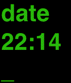

# u-time

## Description
UTime (u-time) is a Pebble watchface that displays time as if commands were typed from the unix console. Others have created similar watchfaces but this one adds a little more console realism (blinking cursor) and the commands "type out" the time change. Console letters are in green on color Pebble watches. Font sizes are larger than other implementations to make using it as a real watch easier.

##Design
Uses a TextLayer to display unix commands. Should work on original Pebble and newer color Pebble Time watches.

##Limitations
- Not a real unix console.

A Pebble watchfaced based on pebbles on [big-time](https://github.com/pebble-examples/big-time) project.
##Build/Test Notes
- pebble login
- pebble list
- pebble build
- pebble install --emulator basalt
- pebble --debug install --emulator basalt
- pebble logs --emulator basalt
- pebble screenshot --emulator basalt

## etc
- I have had little success getting the emulator to work in aplite mode in the current dev kit (PebbleSDK 3.0-beta11) but it runs fine on my Pebble Steel.
- The date command seen assumes it has been aliased!

## References
- [http://developer.getpebble.com/guides/publishing-tools/pebble-tool/](pebble tool commands)
- [http://developer.getpebble.com/blog/2013/07/24/Using-Pebble-System-Fonts/](Pebble Fonts)